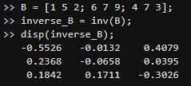

# Transformada de Laplace
## 1. Objetivos del curso
Identificar la simbología usada en la representación de sistemas (mecánicos, hidraulicos, 
eléctricos) para aplicarla en la elaboración de planos y diagramas.  
Reconocer los tipos de modelamiento y el uso para el análisis de sistemas.  
### 1.1 Metodología
Se realizaran clases presenciales teoricas, si se llegan a presentar acontecimientos que impidan llegar a la escuela o dia de virtualidad, se hará la clase mediante la plataforma en TEAMS

## 2. Definiciones  
>🔑*Sistema:* Es una combinación de componentes que actuan conjuntamente para alcanzar un objetivo especifico, la combinación de componentes se puede relacionar por medio de reglas o principios.  
>🔑*Sistema Dinamico:* Un sistema se llama dinamico si su salida en el presente depende de una entrada en el pasado.  
>🔑*Modelos Dinamico:* Son aquellos sistemas que varian conforme al tiempo, que son analizables desde la perspectiva matemática  
>🔑*Sistemas lineas y no lineales:* Se considera un sistema lineal siempre y cuando cumpla con las reglas de un circuito de superposición,.  

## 3. Modelos dinámicos.
Encontrar funciones que determinan el tiempo de una variable o su cambio.
### Derivada de una función

La derivada de una función $f(t)$ con respecto a $t$ se denota como:  
\frac{df(t)}{dt}  
Recordando que la derivada es la pendiente de una curva, tomamos un ejemplo:  
F(x) = x^2  
La derivada de esta función es:  
F'(x) = 2x  
F'(2) = 4  
F'(3) = 6  
### 3.1. Modelos de ecuaciones Diferenciales.  
a1 d^2F/dt`2 + a2 df/dt + a3f= u(t)  
Donde la solución se convierte en un función, en este caso función de (t)  
### 3.2. Transformada de laplace
Es un cambio de función de variable real a una función de variable compleja. La transformada de laplace muestra las señales 
senosiudales y exponenciales  
x(t) - X(s)  
- Transformada inversa  
X(s) - x(t)  
- Transformada de una función   
l{f(t)} = F(s)  
- Transformada de la derivada  
L{f′(t)}=sL{f(t)}−f(0)  
L denota la Transformada de Laplace.  
𝑠 es la variable compleja de la transformada de Laplace.  
𝑓(0) es el valor de la función en 𝑡=0.  
### 3.2. Evaluación del curso
Autoevaluación y coevaluación : 20%  
Parcial: 40%  
Tareas: 30%  
Apuntes: 10%  
  -Plantilla.  
  -2 Ejercicios.  
  -Github.  
### 3.3. Matlab
Es un computo de programación númerico, el cual ofrece distintas tareas conforme a la programación matematica, su nombre se deriva de MATrix LABoratory o Laboratorio de matrices).  
Su sistema se maneja mediante lenguaje de programación unico o propio "Lenguaje M",
Figura 1.
## 4. Ejemplos
💡Ejemplo 1: Transformada de inversa de Laplace  
x''+4x=0            x(0) = 5 ; x'(0)=0  
Donde: x'' = S^2X(s)-sX(0)-X'(0)  
       4x  = 4(X)s  
s^2X(s)-sX(0)-X'(0) + 4(X)s=0  
s^2X(s)-5s+ 4(X)s=0  
X(s)[s^2+4] = 5s  
X(s)=(5s)/(S^2+4)  
5L^-1{s/s^2+2^2}  
5Cos(2t)  
MATLAB:  
  
💡Ejemplo 2:  

## 5. Figuras
Figura 1.

## 6. Código
>> A = [7 8 2; 3 2 6; 5 9 4];  
>> determinant_A = det(A);  
>> disp(determinant_A);  
  -144  

>> B = [1 5 2; 6 7 9; 4 7 3];  
>> inverse_B = inv(B);  
>> disp(inverse_B);  
   -0.5526   -0.0132    0.4079  
    0.2368   -0.0658    0.0395  
    0.1842    0.1711   -0.3026  

## 7. Ejercicios
📚 Determinante de una matriz:  
A = [7 8 2; 3 2 6; 5 9 4];  
determinant_A = det(A);  
disp(determinant_A);  
  
📚 Inversa de una matriz:  
B = [1 5 2; 6 7 9; 4 7 3];  
inverse_B = inv(B);  
disp(inverse_B);  
  

## 8. Conclusiones
Se realizarón los acuerdos y se establecierón los prefijos para las reglas de calificación, se dió a conocer el syllabus como tema para conllevar a lo largo de el curso y los diferentes materiales de apoyo, siendo asi como libros y sistemas de abreviación matematica como MATLAB.
