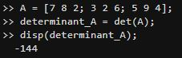

# Sistemas Mecanicos
## 1. Principio General del Modelamiento
Existen 2 tipos de modelo  
- Modelo del balance de masa del sistema, Sistemas hidraulicos.  
- Modelo de balance de energia del sistema, Circuitos de Kirchoff   

Siempre se usa uno de estos tipos de balance que se obtiene
### 1.1 Sistemas Mecanicos
Se modelaran sistemas de resorte - amortiguador  
- Cuando se comprime o se estira un resorte se acumula energia pòtencial, lo cual produce una fuerza de reacción  
Lo cual nos dice la ley de hooke F= Kx = K(x1 - x2)  
Donde K es la constante y X1 y X2 es la distancia que se comprime o se estira el resorte
- Un amortiguador es un embolo que esta metido dentro de una carcasa, el amortiguador funciona por fricción viscosa va a productir una fuerza de reacción cuando intentemos desplazar el embolo  
F= bx = b(x'1-x'2)  
b = constante y x'1 y x'2 es la velocidad en la cual ocurrio eso  

## 2. Definiciones  
>🔑*Fricción en seco:* Es aquella cuando un cuerpo se desliza sobre una superficie no lubricada, o ambas no estan lubricadas (fricción estatica, deslizamiento, rodamiento)  
>🔑*Sistema Dinamico:* Un sistema se llama dinamico si su salida en el presente depende de una entrada en el pasado.  

## 3. Ejemplo.
Ejemplo 1.  
  

1. `u - F_R - F_F = m * a`

2. `u(t) - k2 * y(t) - F_F = m * a`

3. `F_R = k2 * y(t)`

4. `u(t) - k2 * y(t) - k1 * (dy(t) / dt) = m * a`

5. `F_F = k1 * (dy(t) / dt)`

6. `a = d^2 y(t) / dt^2`

7. `u(t) - k2 * y(t) - k1 * (dy(t) / dt) = m * (d^2 y(t) / dt^2)`

### 3.1. Temas del curso
- Pre Requisitos:  
  Ecuaciones diferenciales
- Software:  
  Matlab  
  Simulador de circuitos
- Contenido:  
  Definiciones  
  Solución de ecuaciones diferenciales (transformada de laplace)
- Modelamiento matematico:
  Mecanicos  
  Electricos  
  Hidraulicos  
  Termicos
- Diagrama de bloques:
  Algebla de bloques  
  Diagrama de flechas (Formula de mason)  
  
  
### 3.2. Bibliografía
Se usarán los siguienes libros como referencia a lo largo de todo el curso.  
Libros básicos:  
Dinámica de Sistemas 1ra Edición Katsuhiko Ogata.  
Ingenieria de control moderna katsuhiko Ogata.  
Libros complementarios:  
Control automático de procesos: teoría y práctica Libro de Armando B. Corripio y Carlos A. Smith.  
### 3.2. Evaluación del curso
Autoevaluación y coevaluación : 20%  
Parcial: 40%  
Tareas: 30%  
Apuntes: 10%  
  -Plantilla.  
  -2 Ejercicios.  
  -Github.  
### 3.3. Matlab
Es un computo de programación númerico, el cual ofrece distintas tareas conforme a la programación matematica, su nombre se deriva de MATrix LABoratory o Laboratorio de matrices).  
Su sistema se maneja mediante lenguaje de programación unico o propio "Lenguaje M",
Figura 1.
## 4. Ejemplos
💡Ejemplo 1: Suma de matrices  
A = [7 8 2; 3 2 6; 5 9 4]  
B = [1 5 2; 6 7 9; 4 7 3]  
Se establecío la matriz a y b, cada una de estas con sus respectivos datos separados medianamente por una coma dando asi a las filas.  
Realizando la suma  
C = A + B  
💡Ejemplo 2: Resta de matrices  
Si fuera una resta:  
A = [7 8 2; 3 2 6; 5 9 4]  
B = [1 5 2; 6 7 9; 4 7 3]  
D= A-B    

## 5. Figuras
Figura 1.

## 6. Código
>> A = [7 8 2; 3 2 6; 5 9 4];  
>> determinant_A = det(A);  
>> disp(determinant_A);  
  -144  

>> B = [1 5 2; 6 7 9; 4 7 3];  
>> inverse_B = inv(B);  
>> disp(inverse_B);  
   -0.5526   -0.0132    0.4079  
    0.2368   -0.0658    0.0395  
    0.1842    0.1711   -0.3026  

## 7. Ejercicios
 📚 Determinante de una matriz:  
A = [7 8 2; 3 2 6; 5 9 4];  
determinant_A = det(A);  
disp(determinant_A);  
  
 📚 Inversa de una matriz:  
B = [1 5 2; 6 7 9; 4 7 3];  
inverse_B = inv(B);  
disp(inverse_B);  
  

## 8. Conclusiones
Se realizarón los acuerdos y se establecierón los prefijos para las reglas de calificación, se dió a conocer el syllabus como tema para conllevar a lo largo de el curso y los diferentes materiales de apoyo, siendo asi como libros y sistemas de abreviación matematica como MATLAB.
