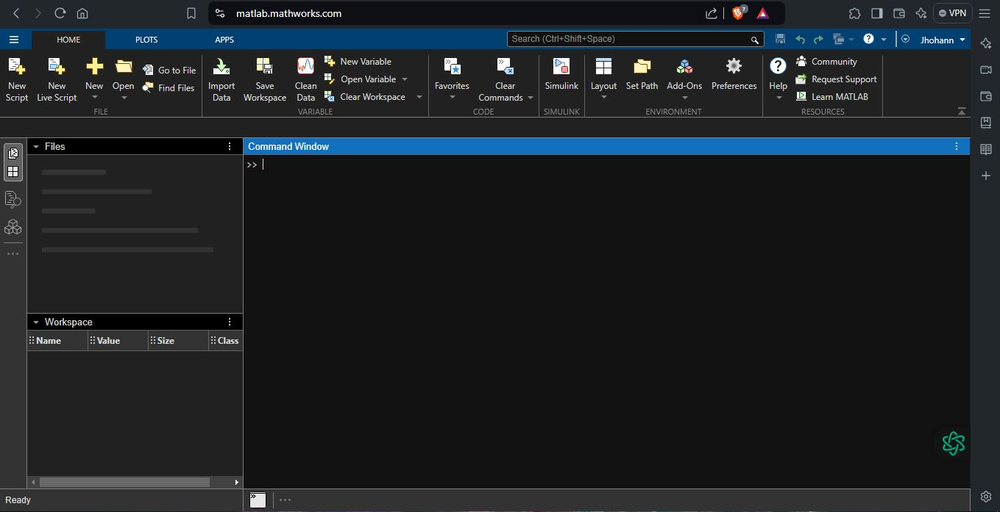

# Presentación del Syllabus
## 1. Subtítulos
Agregue todos los subtítulos que considere necesarios para estructurar el contenido de la clase. Es importante que considere jerarquías de los temas para definir el orden de estos subtítulos. Cada subtítulo debe ir numerado como una sección, de la manera en que lo presenta esta plantilla

## 2. Definiciones  
>🔑*Sistema:* Es una combinación de componentes que actuan conjuntamente para alcanzar un objetivo especifico, la combinación de componentes se puede relacionar por medio de reglas o principios.  
>🔑*Sistema Dinamico:* Un sistema se llama dinamico si su salida en el presente depende de una entrada en el pasado.  
>🔑*Planta:* Se habla de la construccion fisica, sistema electrico, resistencias, condensadores, puede ser representada matematicamente.  
>🔑*Proceso:*: Es la secuencia de pasos que permite desarrollar un producto.  

## 3. Dinamica de Sistemas.
Las subsecciones pueden utilizarse para sub dividir ciertos temas que se tienen en clases, por ejemplo si se está trabajandolos conversores D/A, puede ser necesario subdividir este en circuito de resistencias ponderadas y circuito de escalera R2R. 
### 3.1. Temas del curso
- Pre Requisitos:  
  Ecuaciones diferenciales
- Software:  
  Matlab  
  Simulador de circuitos
- Contenido:  
  Definiciones  
  Solución de ecuaciones diferenciales (transformada de laplace)
- Modelamiento matematico:
  Mecanicos  
  Electricos  
  Hidraulicos  
  Termicos
- Diagrama de bloques:
  Algebla de bloques  
  Diagrama de flechas (Formula de mason)  
  
  
### 3.2. Bibliografía
Se usarán los siguienes libros como referencia a lo largo de todo el curso.  
Libros básicos:  
Dinámica de Sistemas 1ra Edición Katsuhiko Ogata.  
Ingenieria de control moderna katsuhiko Ogata.  
Libros complementarios:  
Control automático de procesos: teoría y práctica Libro de Armando B. Corripio y Carlos A. Smith.  
### 3.2. Evaluación del curso
Autoevaluación y coevaluación : 20%  
Parcial: 40%  
Tareas: 30%  
Apuntes: 10%  
  -Plantilla.  
  -2 Ejercicios.  
  -Github.  
### 3.3. Matlab
Es un computo de programación númerico, el cual ofrece distintas tareas conforme a la programación matematica, su nombre se deriva de MATrix LABoratory o Laboratorio de matrices).  
Su sistema se maneja mediante lenguaje de programación unico o propio "Lenguaje M",
Figura 1.
## 4. Ejemplos
Se realiza un ejemplo sobre creación de matrices, y suma de estas mismas, un ejemplo podría ser este.  
A = [7 8 2; 3 2 6; 5 9 4]   
B = [1 5 2; 6 7 9; 4 7 3]  
Se establecío la matriz a y b, cada una de estas con sus respectivos datos separados medianamente por una coma dando asi a las filas.  
Realizando la suma  
C = A + B;  
disp(C);
Si fuera una resta:  
D= A-B;  

## 5. Ecuaciones
Para la edición de ecuaciones debe utilizar la etiqueta '$$' al comienzo y final de la ecuación para que la ecuación quede centrada ocupando una línea. Si se quiere que la ecuación quede integrada en el texto debe utilizar la etiqueta '$' al comienzo y final de la ecuación. Las ecuaciones pueden ser editadas utilizando el código LATEX, en el siguiente enlace encuentran un editor de ecuaciones que les genera el código. http://www.alciro.org/tools/matematicas/editor-ecuaciones.jsp . Sin embargo hay muchas otras herramientas que pueden utilizar para esto.

💡**Ejemplo 1:** si se va a representar la ecuación de la ley de Ohm se puede mostrar así $R=\frac{V}{I}$ o también,

$$R=\frac{V}{I}$$

## 6. Figuras
Figura 1.



## 7. Tablas
En caso de necesitar la inclusión de tablas para organizar información se recomienda el uso de la herramienta del siguiente enlace https://www.tablesgenerator.com/markdown_tables , la cual permite organizar la información dentro de la tabla y genera el código markdown automáticamente:

💡**Ejemplo 3:** 

| **Resultado** | **x = número de intentos hasta primer éxito** |
|---------------|-----------------------------------------------|
|       S       |                       1                       |
|       FS      |                       2                       |
|      FFS      |                       3                       |
|      ...      |                      ...                      |
|    FFFFFFS    |                       7                       |
|      ...      |                      ...                      |

Tabla 1. Tabla de ejemplo

Cada tabla debe llevar la etiqueta que describa su contenido y numeración consecutiva para todas las tablas

## 8. Código
Teniendo en cuenta que el curso requiere del desarrollo de código matlab, c, c++ u otro. Si requiere incluir pequeños segmentos de código en los apuntes hágalos de la siguiente manera:

💡**Ejemplo 4:**
```
var sumar2 = function(numero) {
  return numero + 2;
}
```

## 9. Ejercicios
 📚 Determinante de una matriz:  
A = [7 8 2; 3 2 6; 5 9 4];  
determinant_A = det(A);  
disp(determinant_A);  


## 10. Conclusiones
Se realizarón los acuerdos y se establecierón los prefijos para las reglas de calificación, se dió a conocer el syllabus como tema para conllevar a lo largo de el curso.

## 11. Referencias
Agregue un subtítulo al final donde pueda poner todas las referencias consultadas incluyendo el origen o fuente de los ejercicios planteados. Tambien dentro del texto referencie los textos o artículos consultados y las figuras y tablas dentro de la explicación de las mismas.
